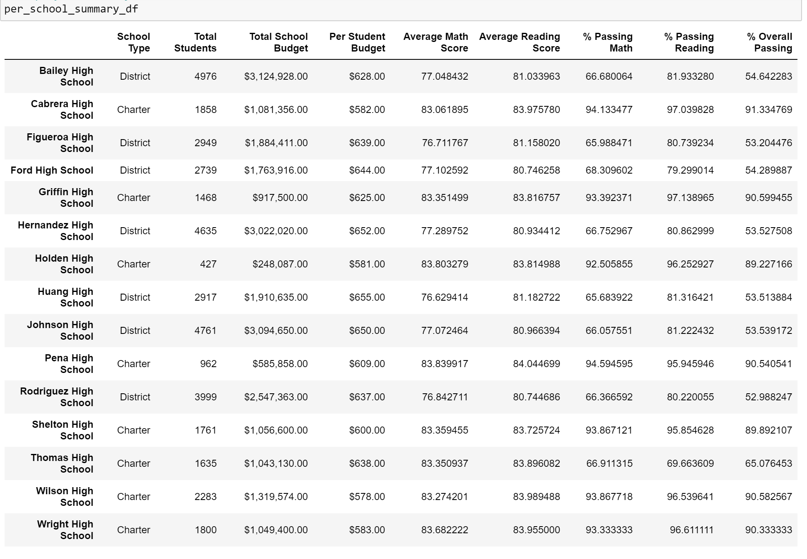
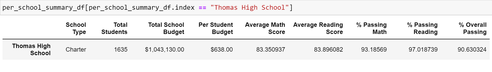

# School_District_Analysis
# Overview of the school district analysis :
Maria, a chief data scientist for a city school district is responsible for analyzing information from a variety of sources and in variety of formats. Tasked with preparing all standardized test data for analysis, reporting and presentation to provide insights about performance trends and patterns. For informed decisions and strategic discussions at the school and district level. Hence we are helping Maria analyze data on student funding and students standardized test scores. 
We have been given access to every student’s math and reading scores as well as various information on the schools they attend. Our task is to aggregate the date and showcase trends in school performance. This analysis will assist school board and superintendent in making decisions regarding the school budgets and priorities. 
For this task the analyzer should be aware of the Family educational rights and privacy act of 1974 or FERPA, which protects the privacy of student education records. The law applies to all schools that receive funds under an applicable program of the US Department of Education. Hence we to make sure that we treat the data with utmost confidentiality to protect the students you are reporting on.

## The purpose of this analysis :
The school district analysis will assist school board and superintendent in making decisions regarding the school budgets and priorities. 
The school district summary will be a high-level snapshot of the district's key metrics:
•	Total number of students
•	Total number of schools
•	Total budget
•	Average math score
•	Average reading score
•	Percentage of students who passed math
•	Percentage of students who passed reading
•	Overall passing percentage
Also the school board has notified Maria and her supervisor that the students_complete.csv file shows evidence of academic dishonesty; specifically, reading and math grades for Thomas High School ninth graders appear to have been altered. Although the school board does not know the full extent of the academic dishonesty, they want to uphold state-testing standards and have turned to Maria for help. She has asked you to replace the math and reading scores for Thomas High School with NaNs while keeping the rest of the data intact.
So considering the above information, we will be first extracting the scores of Thomas High School in order to get more accurate percentage of scores.
And will be able to get an honest conclusion of the how all the schools are performing.
## Results: 
### 1. Replacing the reading and math scores and Repeating the school district analysis
After extracting the data of Thomas High School - 9th Graders from the district summary, we found that there wasn’t much difference in the average scores and percentages.

 To understand more impact of on the grades we decided to recalculate the average scores of math and reading of Thomas high school separately and then update the school summary accordingly.
The old school summary reflected as below :

### 2. Recalculating the school summary
After recalculating the math & reading scores of Thomas High School for grades from 10th to 12th(excluding the 9th grade), we found that the percentages for Thomas High School infact went up. 

The overall percentage for Thomas High School went up from 65% to 90%. Thereby making Thomas High school rank in the top 5 performing schools.
The revised school summary report for all schools is as below :

### 3. High and Low Performing Schools : 
Cabera High school is highest ranker in the top performing schools. And inspite of changing the calculation of scores of Thomas High School, it is still ranking second amongst the top performing schools.

 

Low Performing Schools

### 4. Math and Reading Scores by Grade
In order to get more in depth knowledge on the performance, we grouped the analysis grade wise. Giving more details as to which grade needed more assistance.

 
It was discovered that the scores of all grades were more or less at the same level.
### 5. Scores by School Spending
In order to understand whether the school spending was enough to meet the needs of the student and how it affected their performance. We created bins to analyze the scores based on spending.

 

As per the above summary related to the spending bins, it was discovered that some schools that had the lowest spending per student still managed to achieve an overall passing percentage of 90%, whereas some schools with a spending range of above $645 per student were only able to achieve an overall passing percentage of 53%. On the basis of this conclusion the district can not only allocate funds accordingly but also understand from the schools as to what kind of support they can over to help alleviate their score results.

### 6. Scores by School Size
To get more indepth understanding of the performance of schools, an analysis on the size of the schools was conducted.

 
It was discovered that schools with a size of more than 2000, had a low performance level in spite of higher spending.

### 7. Scores by School Type
It was important to understand as to which type of schools were performing better.

 
And it was discovered were that the charter schools had a way better level of performance than the district schools with an overall passing percentage of 90% as compared to the passing percentage of district schools which was 54%.

## Summary:
The following four changes were concluded after to the school district analysis after reading and math scores were replaced :
1.	After nullifying the scores of the 9th graders of Thomas High School, we didn’t see much of a difference in the school district summary. The difference was only by 1%.
2.	After nullifying the scores of the 9th graders, Thomas High School did not qualify to be in the top 5 ranking schools.
3.	But when the scores of Thomas High School were reevaluated for 10th to 12th graders, the average scores and percentages of Thomas High School drastically changed levelling up Thomas High School. 
4.	After the recalculation of the scores of 10th to 12th grade of  Thomas High School, it was ranking second in the overall percentage among the top 5 schools of the district.

We can also conclude the following from the overall analyis :
    The schools that did academically well were mostly charter schools. Hence the district need to find ways to guide the district schools on how they can work on their academic progress. The schools with a high volume of students had a direct impact onto their academic success and hence the district needs to address that aspect.